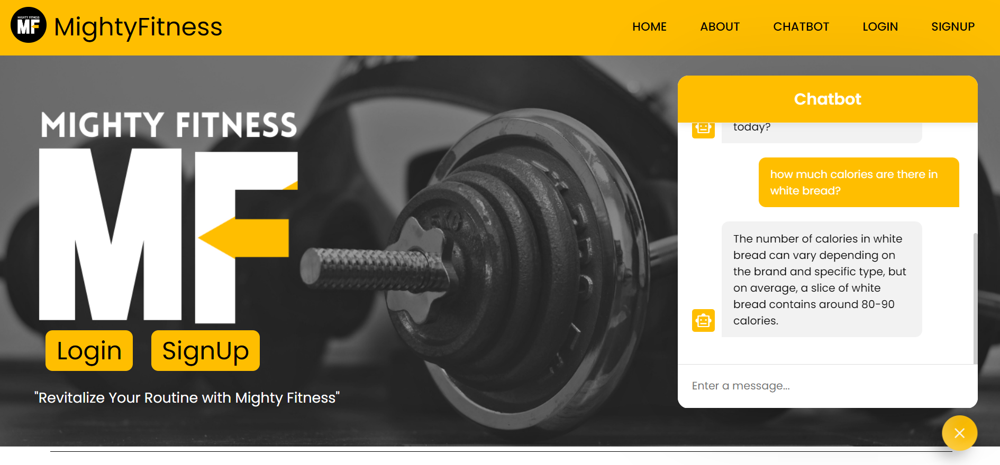
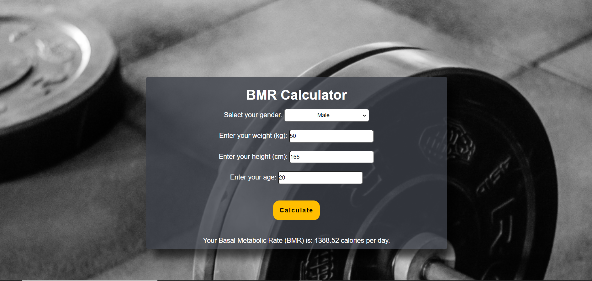
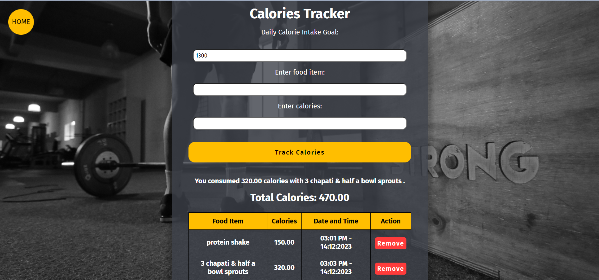
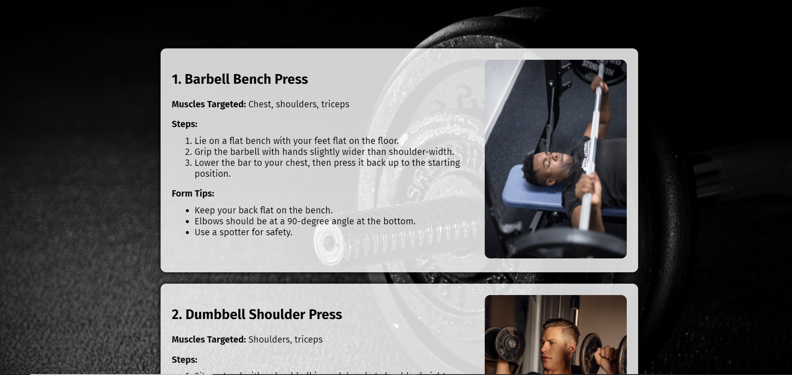
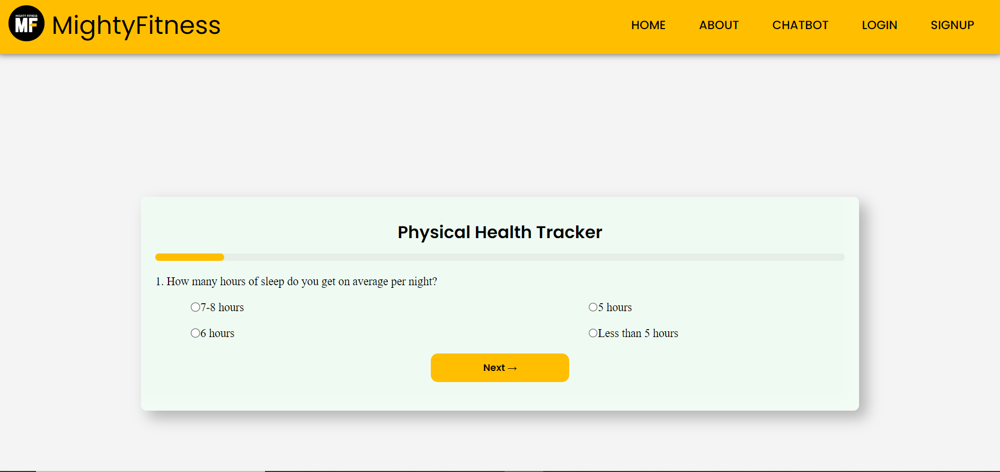

Welcome to Mighty-Fitness, your one-stop solution for achieving your health and fitness goals. This web application is designed to empower you on your journey to a healthier lifestyle, offering a range of features to support your fitness endeavors.

Features:
1. Chatbot - Your 24/7 Fitness Guide

Our AI-enabled fitness guide is available round the clock to assist and guide you. Whether you have questions about workouts, nutrition, or need motivation, the chatbot is here to help.

2. BMR Calculator

Calculate your Basal Metabolic Rate (BMR) with our calculator to tailor your nutrition and fitness goals. This feature provides personalized insights to optimize your health and well-being.

3. Calories Restrictor

Promoting mindful eating, the Calories Restrictor tool guides you toward a balanced and healthier lifestyle. Stay on track with your nutrition goals and make informed choices for optimal health.

4. Workout Plans

Access structured workout routines designed to elevate your strength and overall fitness. Whether you're a beginner or an advanced fitness enthusiast, our workout plans cater to all levels.

5. Health Tracker

Monitor and track your health progress with our Health Tracker tool. Log your workouts, track your nutrition, and stay accountable on your fitness journey.

6. Supplements Portal

Explore information about various supplements and find links to purchase them. Make informed decisions about the supplements that can complement your fitness routine.

Getting Started
Prerequisites
Make sure you have the latest web browser installed.
Create an account on FitnessHub to unlock personalized features.
Installation
Clone the repository: git clone https://github.com/syedkumailraza1/Mighty-Fitness
Navigate to the project directory: cd FitnessHub
Open index.html in your preferred web browser.
Contributing
We welcome contributions from the community. If you have ideas for new features, improvements, or bug fixes, feel free to open an issue or submit a pull request.
